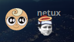
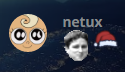

### Glossary
**Group:** Collection of emotes from the same source. E.g. TwitchTV, Better TwitchTV, _give dem emotes_

**Zero-Width emote:** Emotes that overlap other emotes, more information below.

**Code (of an emote):** Also called Regexp/RegExp, it's the "name" of the emote, the text used to represent it. E.g. Kappa, LUL, PANTSU

**Endpoint:** Term used to refer to the URL used to fetch a resource from the internet, the _end point_ of an API. E.g. the URL of any of _give dem emotes_ supported group's API. 


### FAQ
#### What are Zero-Width emotes?
`zero-width` emotes are one's that don't actually occupy space, but are overlapped on other emotes (like SantaHat)

|  |
|:----------------------------------------------------------:|
|                     `:Kappa:SantaHat:`                     |

The emotes have to be next to each other, or else they will appear separated:

|  |
|:------------------------------------------------------------:|
|                    `:Kappa: :HalloHalo:`                     |

And yes, you can stack them!

|  |
|:--------------------------------------------------------------------:|
|                     `:Kappa:SantaHat:HalloHalo:`                     |

#### What are the emotes with a hyphen (`-`) and a number after their code?
While fetching the emotes, _give dem emotes_ lower-cases their code. This allows for typing `:Kappa:`, `:kappa:` or `:kAppA:` and still get the same result.

Problem comes when on an endpoint they are multiple emotes who's code, when lower-cased, is the same.

To solve this problem, if there is already an emote with the lower-cased code registered on the same group, _give dem emotes_ adds a "-<number>" after it.

#### I want to use a certain emote, but another emote appears
This is probably because another group has an emote with the same code lower-cased. In that case, use `:group>code:` instead of just `:code:`.

If the problem persists, then you should consider [requesting the emote](#requesting-emotes)


### Requesting emotes
#### Files
[`api.json`](api.json) and [`api_zerowidth.json`](api_zerowidth.json) are the files storing _give dem emotes_'s emotes, along with some extras.
Both files have the format:
```js
{
    "<group>": {
        "<code(s)>": DATA
    },
    <...>
}
```

If the emote should have more than one code, then separate them with a vertical line (`|`). E.g. "yeahsure|yeasure" will make `:yeahsure:` and `:yeasure:` render the same emote.

##### `api.json`

|       Group       | `DATA` is | Where to get it | Example |
|:-----------------:| --------- | --------------- | ------- |
|      TwitchTV     | Emote's ID | [twitchemotes.com](https://twitchemotes.com/). Use the top left bar to find the emote you want and click on it to go to it's page, the ID should be the numbers at the end of the URL. | `"KappaRoss": "70433"`
|   Better TwitchTV | Emote's ID | [manage.betterttv.net](https://manage.betterttv.net/emotes/share/). Connect your TwitchTV account, go to the bottom of the page, find the emote and click on it to go to it's page, the ID should be the text at the end of the URL. | `"tf": "54fa8f1401e468494b85b537"`
|      TastyCat     | Emote's image URL | [emotes.tastycat.org](https://emotes.tastycat.org/). Find the emote you want, right click it's image and press "Copy image address". | `"NyanCat": "https://emotes.tastycat.org/emotes/cats/NyanCat.gif"`
|        RCS        | Emote's image file name | [rcs.radiant.dj/emotes](https://rcs.radiant.dj/emotes). The file name is usually the emote's code plus the extension ".png", or ".gif" if it's animated. | `"1up": "1up.png"`, `"portal": "portal.gif"`
|    FrankerFaceZ   | Emote's ID | [frankerfacez.com/emoticons/](https://www.frankerfacez.com/emoticons/). Use the bar on the left to find the emote you want and click on it's name, the ID should be the numbers at the end of the URL (without the "-emote's code" part). | `"OhMyDood": "89824"`
|     DeviantArt    | Emote's image object → `subdomain` and `path` | [DeviantArt's emoticons section](https://www.deviantart.com/browse/all/customization/emoticons/animated/). Make sure the sizes are at least in Medium. Right click on the emote's image, open in a new tab, and get the `DATA` from the URL as is: http://**SUBDOMAIN**.deviantart.net/**PATH** | `{ "subdomain": (REDACTED), "path": (REDACTED) }`
| _give dem emotes_ | Emote's image file name or Emote's image URL (if it's from an external source) | Custom! Make them yourself ;) | `"catbugDance": "catbugDance.gif"`

##### `api_zerowidth.json`
This file is more limited, only TwitchTV and Better TwitchTV emotes are supported, and there can't be multiple emotes. 

`DATA` is...
```js
ID
```
or, if the emote should be pushed to the top a little:
```js
{
    id: ID,
    isHat: true
}
```

#### Size
On custom emotes, the image must be at least 200 pixels in width and/or height. E.g. 200x200, 200x199, 199x200.

Also, please remove any extra transparent pixels on the image.

#### How to
- Check if the emote is already on _give dem emotes_
- Fork this repository.
- If the emote is custom (_give dem emotes_)...
    - Add the image to this folder (`/userscript/gde/emotes/`) and add the emote
- Go to the JSON file and add the emote at the bottom of the group.
- Create a Pull Request
    - The title should be "New emote for `<group>`: `<code>`"
    - Make sure to give credit to the author of the image, in case it wasn't you

Example of file with new emote
```js
{
    <... other groups>
    "gde": {
        <... other emotes>
        "<code>": <data>
    },
    <... other groups>
}
```
```js
{
    <... other groups>
    "deviantart" {
        <... other emotes>
        "<code>" {
            "subdomain": <subdomain>
            "path": <path>
        }
    },
    <... other groups>
}
```